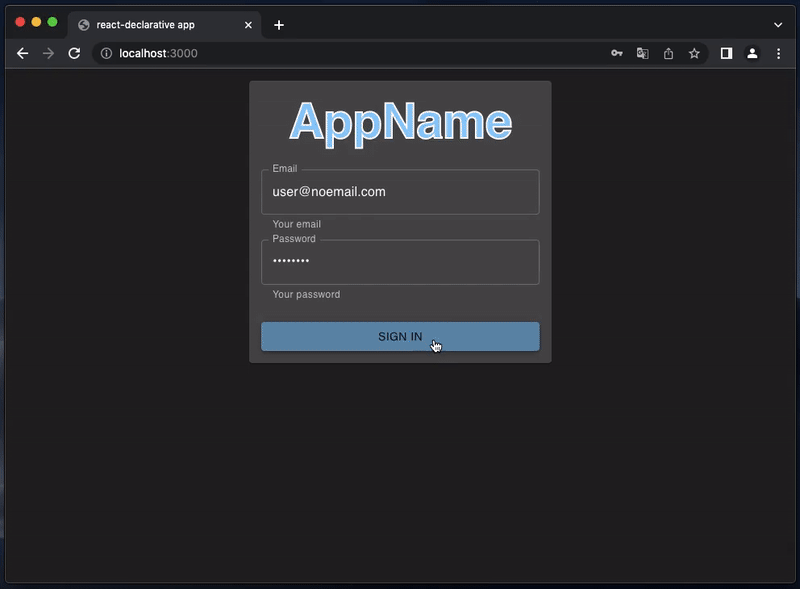

# ⚛️ cra-template-appwrite

> Contains the most advanced appwrite starter kit which you ever seen!

[](https://npmjs.org/package/cra-template-appwrite)



## Usage

```bash
yarn create react-app --template cra-template-appwrite .
```

or

```bash
npx create-react-app . --template=appwrite
```

## What's inside

1. [TypeScript](https://www.typescriptlang.org/)
2. [MUI](https://mui.com/)
3. [Mobx](https://mobx.js.org/)
4. [MSW](https://mswjs.io/)
5. [tss-react](https://www.tss-react.dev/)
6. [react-declarative](https://www.npmjs.com/package/react-declarative)
7. [appwrite](https://www.npmjs.com/package/appwrite)
8. [local-web-server](https://www.npmjs.com/package/local-web-server)

## Code sample

```tsx
import { useState } from 'react';
import {
    FetchView,
    RecordView,
    ActionTrigger,
    useReloadTrigger,
    IActionTrigger,
} from 'react-declarative';

import ioc from '../../lib/ioc';

interface ITodoOnePageProps {
    id: string;
}

const actions: IActionTrigger[] = [
    {
        label: 'Mark as complete',
        action: 'complete-action',
    }
];

export const TodoOnePage = ({
    id,
}: ITodoOnePageProps) => {

    const { reloadTrigger, doReload } = useReloadTrigger();
    
    const [search, setSearch] = useState('');

    const state = async () => await ioc.todoDbService.findById(id);

    const handleAction = async (action: string) => {
        if (action === 'complete-action') {
            await ioc.todoDbService.update(id, {
                completed: true,
            });
            doReload();
        }
    };

    return (
        <>
            <ActionTrigger
                actions={actions}
                onAction={handleAction}
            />
            <FetchView state={state} deps={[reloadTrigger]}>
                {(data) => (
                    <RecordView
                        onSearchChanged={(search) => setSearch(search)}
                        search={search}
                        data={data}
                    />
                )}
            </FetchView>
        </>
    );
};

export default TodoOnePage;

```
